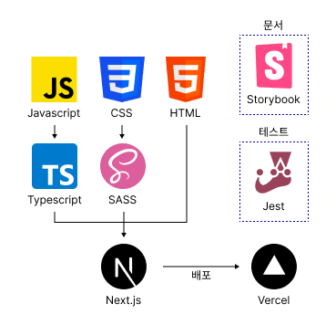

# Pianest

피아노 코드 운지법을 알려주는 서비스입니다.

배포링크: (아직 배포링크 없음)

## 시작

```bash
# 개발환경 서버 시작
npm run dev

# Storybook
npm run stroybook

# 테스트
npm run test
```

## 시스템 아키텍쳐



## src

- [app](./src/app/README.md): `Next.js`의 `App Router` 폴더
- images: 이미지를 모아둔 폴더
- [modules](./src/modules/README.md): 모듈을 모아둔 폴더
- styles: css초기화, 전역스타일, 디자인 토큰 등 프로젝트 전반에서 사용하는 스타일이 모여있는 곳
